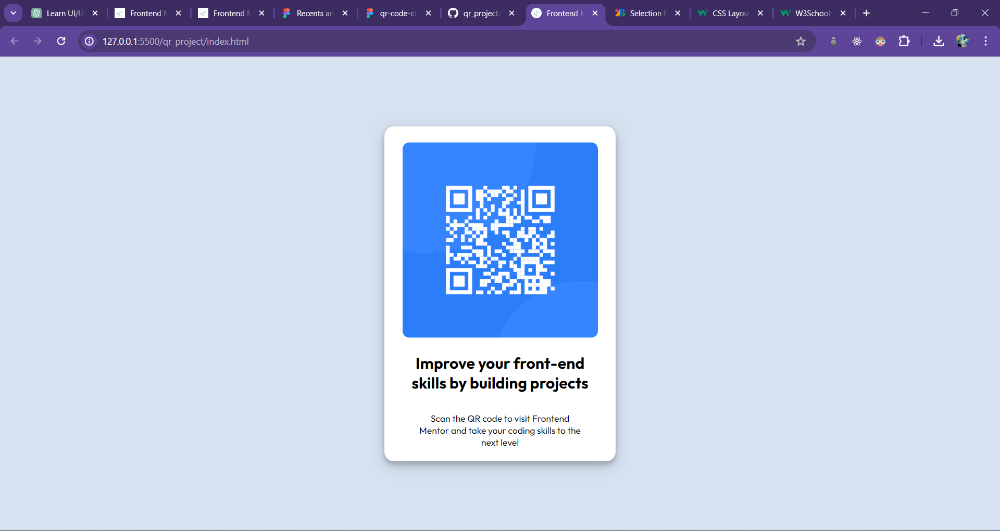

# Frontend Mentor - QR code component solution

This is a solution to the [QR code component challenge on Frontend Mentor](https://www.frontendmentor.io/challenges/qr-code-component-iux_sIO_H). Frontend Mentor challenges help you improve your coding skills by building realistic projects.

## Table of contents

- [Overview](#overview)
  - [Screenshot](#screenshot)
  - [Links](#links)
- [My process](#my-process)
  - [Built with](#built-with)
  - [What I learned](#what-i-learned)
  - [Continued development](#continued-development)
  - [Useful resources](#useful-resources)
- [Author](#author)
- [Acknowledgments](#acknowledgments)

**Note: Delete this note and update the table of contents based on what sections you keep.**

## Overview

### Screenshot



### Links

- Solution URL: [Add solution URL here](https://github.com/Manglam11/qr_project.git)
- Live Site URL: [Add live site URL here](https://manglam11.github.io/qr_project/)

## My process

### Built with

- Semantic HTML5 markup
- CSS custom properties
- Flexbox
- Mobile-first workflow

### What I learned

- I become aware about mobile first approach and benifit of it.
- Learn the use of styling through proper div sections.

```css
.container {
  height: fit-content;
  width: 355px;
  display: flex;
  flex-direction: column;
  justify-content: center;
  align-items: center;
  background-color: hsl(0, 0%, 100%);
  border-radius: 15px;
  margin: 200px 20px;
  padding: 0;
  box-shadow: 0 4px 8px 0 rgba(0, 0, 0, 0.2), 0 6px 20px 0 rgba(0, 0, 0, 0.19);
}
```

### Useful resources

- [resource](https://www.w3schools.com/css/css_positioning.asp) - This helped me for styling. I really liked their way of teaching and will use it going forward.

## Author

- Website - [MANGLAM DUBEY](https://manglam11.github.io/qr_project/)
- Frontend Mentor - [@Manglam11](https://www.frontendmentor.io/profile/Manglam11)
